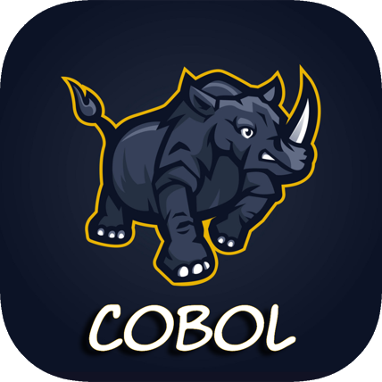
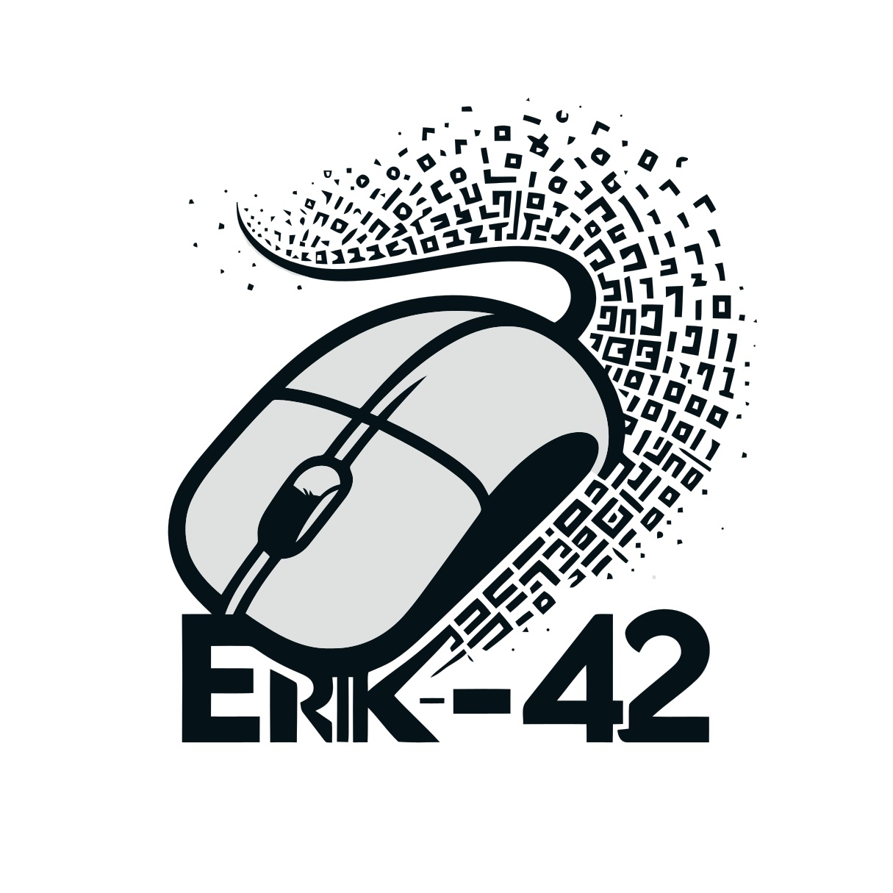

  <h1>Esprit-COBOL</h1>
  
<strong>Apprendre le COBOL en français</strong>

  
    
  <a href="https://erik-42.github.io/esprit_cobol/">
 

  
Sommaire

  <ol>
    <li><a href="#a-propos">À propos</a></li>
    <li><a href="#ce-que-vous-trouverez">Ce que vous trouverez</a></li>
    <li><a href="#decouvrir-le-site">Découvrir le site</a></li>
    <li><a href="#soutenir-le-projet">Soutenir le projet</a></li>
    <li><a href="#licence">Licence</a></li>
    <li><a href="#contact">Contact</a></li>
  </ol>

## À propos

**Esprit-COBOL** est un site d’apprentissage du COBOL entièrement en français.

Le COBOL est un langage clair et structuré, encore très présent dans les banques, les assurances et les administrations. Esprit-COBOL vous aide à le découvrir pas à pas : historique, bases, instructions, logiciels et tutoriels pratiques.

## Ce que vous trouverez

- **Histoire** — d’où vient le COBOL et pourquoi il reste d’actualité
- **Bases** — structure d’un programme, variables, concepts essentiels
- **Instructions** — les mots-clés et constructions utiles au quotidien
- **Logiciels** — outils pour écrire et compiler du COBOL (GnuCOBOL, éditeurs, etc.)
- **Tutoriels** — une quinzaine d’exercices progressifs (débutant → avancé), avec énoncé, correction à la demande, impression et export
- **Liens** — ressources utiles pour aller plus loin
- **Contact** — pour poser une question ou signaler une amélioration
- **Soutien** — pour encourager le projet via Buy Me a Coffee

## Découvrir le site

Rien à installer : ouvrez simplement la version en ligne :

**https://cobol.basillecorp.dev/**

## Soutenir le projet

Si Esprit-COBOL vous est utile, vous pouvez offrir un café :

https://buymeacoffee.com/meseneriko/bienvenue-dcouvrez-l-aventure-derrire-cobol-basillecorp-dev

## Licence

Distribué sous licence **GPL-3.0**. Voir le fichier `LICENSE.txt` pour plus de détails.

## Contact

[![GitHub followers][github followers-shield]][github followers-url]
[![Stargazers][stars-shield]][stars-url]
[![GitHub repo][github repo-shield]][github repo-url]
[![wakatime][wakatime-shield]][wakatime-url]

[![Github Badge][github badge-shield]][github badge-url]
[![LinkedIn][linkedin-shield]][linkedin-url]

<a href = 'https://basillecorp.dev'>  basillecorp.dev</a>

Portfolio: 
https://bash-cv.vercel.app/

[https://buymeacoffee.com/meseneriko](https://buymeacoffee.com/meseneriko)

Contactez moi: [erik.mesen@basillecorp.dev](mailto:erik.mesen@basillecorp.dev)

(<a href="#readme-top">back to top</a>)

<!-- MARKDOWN LINKS & IMAGES -->
<!-- https://www.markdownguide.org/basic-syntax/#reference-style-links -->

[wakatime-shield]: https://wakatime.com/badge/user/f84d00d8-fee3-4ca3-803d-3daa3c7053a5.svg
[wakatime-url]: https://wakatime.com/@f84d00d8-fee3-4ca3-803d-3daa3c7053a5
[github badge-shield]: https://img.shields.io/badge/Github-Erik--42-155?style=for-the-badge&logo=github
[github badge-url]: https://github.com/Erik-42
[github repo-shield]: https://img.shields.io/badge/Repositories-68-blue
[github repo-url]: https://github.com/Erik-42/Erik-42?tab=repositories
[github followers-shield]: https://img.shields.io/github/followers/Erik-42
[github followers-url]: https://github.com/followers/Erik-42
[contributors-shield]: https://img.shields.io/github/contributors/Erik-42/export-project-structure
[contributors-url]: https://github.com/Erik-42/export-project-structure/graphs/contributors
[forks-shield]: https://img.shields.io/github/forks/Erik-42/export-file-structure
[forks-url]: https://github.com/Erik-42/export-file-structure/forks
[issues-shield]: https://img.shields.io/github/issues-raw/Erik-42/export-file-structure
[issues-url]: https://github.com/Erik-42/export-file-structure/issues
[stars-shield]: https://img.shields.io/github/stars/Erik-42
[stars-url]: https://github.com/Erik-42?tab=stars
[linkedin-shield]: https://img.shields.io/badge/-LinkedIn-black.svg?style=for-the-badge&logo=linkedin&colorB=555
[linkedin-url]: https://www.linkedin.com/in/erik-mesen/
[html-shield]: https://img.shields.io/badge/-LinkedIn-black.svg?style=for-the-badge&logo=linkedin&colorB=555
[html-url]: https://html.spec.whatwg.org/
[css-shield]: https://img.shields.io/badge/-LinkedIn-black.svg?style=for-the-badge&logo=linkedin&colorB=555
[css-url]: https://www.w3.org/TR/CSS/#css
[javascript-shield]: https://img.shields.io/badge/-LinkedIn-black.svg?style=for-the-badge&logo=linkedin&colorB=555